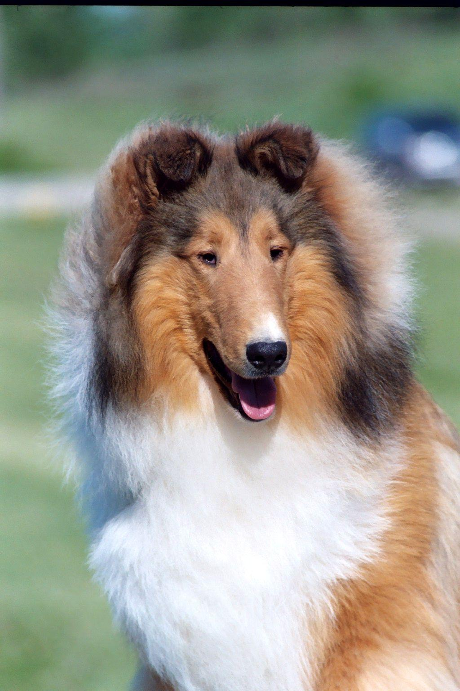
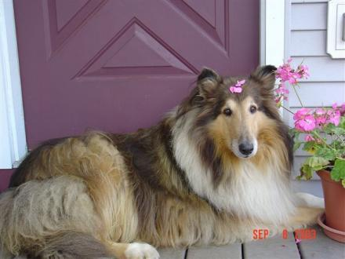
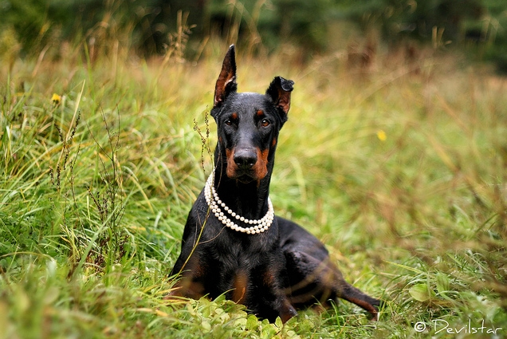
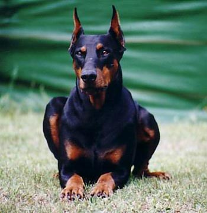
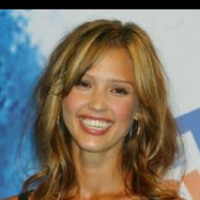

# Dog breed classifier using Convolutional Neural Networks (CNNs).

### Introduction
This project is the last of [Udacity](www.udacity.com) Data Science Nanodegree required assignments.

The goal is to build a dog breed classifier based on CNNs, and deploy it to a web-based app. The model and algorithm has been built step by step in a Jupyter notebook. You are more than encouraged to check it out!

In the end an accuracy of almost 82% is obtained in test data.

### Instructions for the app
Apart from basic python libraries, the following packages are required:
- tensorflow.keras which handles neural networks structures.
- flask to handle the back-end of the app.
- opencv-python to build the face detector.

After installing required libraries, all is required is to run the following command:

`python run.py`

and open a browser with the following value on the url:

`http://0.0.0.0:3001/`

### Instructions for the notebook
A notebook that gives a more clear explanation of the steps followed to develop this classifier is included in the repository.

However, extra files are required to run all the steps that can be downloaded from the following [link](https://drive.google.com/drive/folders/11_ovr-NxsLR2OVKa6kSxOlIDIUbuCBdd?usp=sharing).

The files should be placed on the folder with the same name, and the tar file inside /data should be decompressed by the following command:

`tar -xf data_dog_human.tgz`

Finally, to run the notebook a jupyter session is created **from the root directory**, otherwise the notebook won't be able to pick up files that are in a folder that is one level up:

`jupyter notebook`

### Files description:
**bottleneck_features**: Folder.
  - **DogResnet50Data.npz**: Bottleneck features from Resnet50 CNN.
  - **extract_bottleneck_features.py**: Python script containing functions required to extract bottleneck features.
**data**: Folder.
  - **dog_names.csv**: Csv file containing the different dog breeds.
**dog_breed_app**: Folder.
  - **images**: Folder containing the images uploaded to the app.
  - **__init__.py: Python script that initializes Flask.
  - **routes.py**: Python script containing the back-end code.
  - **static/img**: Folder containing the images used by default in the app. 
  - **templates**: Folder.
    - **index.html**: Html code containing the front-end of the app.
**face_detector**: Folder containing the xml file used by the face detector.
**images**: Folder containing pictures that can be used to test the app. In particular, the ones inside validation_imgs correpond to the images used in Part 6 of the notebook to validate the algorithm. Please note that some of the images in images folder are used by the Jupyter notebook.
**notebook**: Folder containing the notebook that was used to develop the project.
**run.py**: Python script to start the app.
**saved_models**: Folder containing the weighted factors used by the CNN.
**wrangling_scripts**: Folder.
  - **CNN_functions.py**: Python script containing all the functions required to run the CNN.

### How to interact?
For any questions you can contact me on dcalvomayo@gmail.com

Find this, and other cool projects on my [Github](https://github.com/dcalvomayo)

### Licensing
You may take any code, but don't forget to cite the source. Take into account that some code was developed by [Udacity](www.udacity.com).

## Project definition

### Project Overview

The goal is to develop an algorithm that classifies images depending on the dog breed.

For this purpose, convolutional neural networks (CNNs) will be explored due to its proven record of capabilities or image classification. In particular, the final algorithm will benefit from transferred learning of a reknown CNN with Imagenet database. This way it is possible to reduce the computational time towards obtaining an acceptable model.

Finally, the algorithm is deployed to a web-app where any user will be able to test it in a very straightforward way. 

### Problem Statement

The algorithm should proceed in the following way:
1. Accept an image.
2. Detect if an image is a dog, human, or neither:
3. If image contains a dog then predict the breed. If the image contains a human it should still assign a breed. Finally if the image is neither go back to step 1.

### Metrics

For this case, since the focus of the problem is to learn about how to build CNN algorithms, we are going to keep it simple on the metrics so we will limit to compute the accuracy: number of times the algorithm assigns correctly a breed vs number of images that we analyze.

It should be noted that if we want to have a better picture of the performance of our algorithm we should look into building confusion matrices which can be generalized to multi-class problems such as [this](https://towardsdatascience.com/comprehensive-guide-on-multiclass-classification-metrics-af94cfb83fbd).

## Analysis

### Data Exploration

The data that we will use to build the model consists of 9148 images of dogs in .jpg format organized in folders named after the corresponding class that they belong to.

The number of classes or dog breeds that we take into account is 133 and go from Affenpinscher to Yorkshire Terrier. This is less than what [AKC recognizes](https://www.akc.org/press-center/articles-resources/facts-and-stats/breeds-year-recognized/), but even that it is a lower number, it is still an extraordinary classification task, especially when there are pairs of breeds such as Brittany and Welsh Springer Spaniel or Curly Coated Retriever and American Water Spaniel that are very similar, as shown in the notebook. Also, the number of images per breed oscillates between 38 and 101.

We also have around 24000 images of different human beings that are organized in the same way, so that they could be used to classify images depending on the person contained on it. For our purpose we will use them to test how our algorithm distinguishes between humans and dogs.

### Data Visualization

Examples of images containing dogs of breed Collie are:

 | 

Examples of images containing dogs of breed Doberman pinscher are:

 | 

Examples of images containing humans are the following. For instance, we have Jessica alba with:

 | 

## Methodology

### Data Preprocessing

For being able to utilize the data we need to convert it to a format that can be handled by the library that we will use to build neural networks [Keras)](https://keras.io/). We need to build a pipeline that covers the following steps. For that we will use the functions contained in images library of keras.

1. Resize: In the previous section we saw that the images have different sizes, therefore we need to transform them so that we have the same number of pixels in both directions. This is achieved with load_img in which we can set parameter target_size to be (224,224) or what is the same: 224 pixels for both directions.

2. Convert to array: This is achieved with img_to_array that  and expand_dims to resize it so that all of the images can be integrated on the same tensor. Its dimension, taking into account that we have 3 channels, will be:

(224, 224, 3)

3. Integrate all the images into one array: This is achieved with expand_dims that will expand each image into a 4D array so that they can be on the same array of dimension:

(nb_samples, 224, 224, 3)

4. Normalize the images by dividing by 255 which correspond to the number of values that any pixel can take.

These steps are enough in order to process our image data with Keras. However, if we want to use a pre-trained model such as ResNet-50 we need further pre-processing to reorder and provide additional normalization to the channels. More information on this regard can be found in the notebook, but we can import the function preprocess_input which will do exactly those.

### Implementation

If we recall our problem statement we need to first accept an image: this is covered by the Data Preprocessing section. Now, the second step is to identify whether a human, dog, or anything else is contained in it.

- Let's first address how to identify humans. For that we can use a face detector based on [Haar feature-based cascade classifiers](http://docs.opencv.org/trunk/d7/d8b/tutorial_py_face_detection.html). We'll use a test set of 100 images of dogs and 100 images of humans. The results turn out that in 12% of dogs a face is detected, and only in 1% of humans a face is not detected. This makes it a good model to detect humans, but not to rule out dogs. We also need to take into account that by using a face detector we are limiting our algorithm to use images in which a clear view of the face is presented. For the purpose of this project, and with the database that we have this seams reasonable, but if we wanted to use the algorithm to discern between animal and human shapes at night in a security camera to sound an alarm, for example, this would not be acceptable.  

- Now we can move onto identifying dogs. We can benefit from pre-trained Res-Net50 model to build a dog detector since if we look carefully at its [dictionary](https://gist.github.com/yrevar/942d3a0ac09ec9e5eb3a) it contains dog categories in keys 151-268. We test it with 100 images of dogs and 100 images of humans, and we see that only 4% humans are incorrectly classified as dogs, and not a single dog is incorrectly classified. This makes it a good model to detect dogs, and acceptable to rule out humans.

This covers the second step, and we move now onto the third step which is for which we will build a convolutional neural network.

- Model 1: First, we will create a convolutional neural network from scratch. In image classification we are passing as input a fairly large amount of data expecting an output that is very small compared to the number of combinations of all the pixels of the image. Therefore, it makes sense to use a deep learning algorithm with several convolutional layers, since the geometrical information can be captured by these. The number of layers is going to be determined by a trade-off of the accuracy that we can get, and the time that we can afford to invest training it. We choose to use four convolutional layers at this stage since the idea is to learn how a convolutional layer is built from scratch, and we are targeting an accuracy of >1%. Also, we add MaxPooling layers in between to reduce the dimensionality in stages, so that the network can focus on other features as the data goes deeper in the network. Finally, we add a global average pooling layer that will map one field per category, and a fully connected layer just before the output. By trial and error it has been found that 'relu' activation function works better for the convolutional layers, while softmax does for the fully connected layer. This is how the structure looks like:

| Layer (type) | Output Shape | Param |
| -------------|--------------| ----- |
| conv2d_3 (Conv2D) | (None, 223, 223, 16) | 208 |      
| max_pooling2d_3 (MaxPooling2) | (None, 111, 111, 16) | 0 |        
| conv2d_4 (Conv2D) | (None, 110, 110, 32) | 2080 |      
| max_pooling2d_4 (MaxPooling2) | (None, 55, 55, 32) | 0 |         
| conv2d_5 (Conv2D) | (None, 54, 54, 64) | 8256 |      
| max_pooling2d_5 | (MaxPooling2) | (None, 27, 27, 64) | 0 |         
| global_average_pooling2d_1 | ( (None, 64) | 0 |         
| dense_1 (Dense) | (None, 133) | 8645 |      

Total params: 19,189
Trainable params: 19,189
Non-trainable params: 0

- Model 2: We also create another convolutional neural network, but this time we take advantage of a well known architecture that has been trained with a large database that even includes dog breeds, which is ResNet50. Because of the similarity that ImageNet database has with our images, standard practice is to use almost all of the trained network, and only retrain the very last layers. Therefore, we will use all the network up to the last convolutional layer, and add only a max_pooling2d layer and a global_average_pooling2d layer before the fully connected layer that will be activated with a 'relu' activation function in the same way as in the network that we created from scratch. This is how the structure looks like:

| Layer (type) | Output Shape | Param |   
|--------------|--------------|-------|
| global_average_pooling2d_3 | (None, 2048) | 0 |         
| dense_3 (Dense) | (None, 133) | 272517 |    

Total params: 272,517
Trainable params: 272,517
Non-trainable params: 0

### Refinement

Building Model 1 it was observed that the activation function used on the fully connected layer has an important impact on the accuracy attained. In particular, at first it was built using a relu function, and it was hard for the accuracy to improve beyond.

Also, the number of layers is explored. Instead of using 3 convolutional layers, one more was added modifying the number of filters. So that the structure was the following:

| Layer (type) | Output Shape | Param |
| ------------ | ------------ | ----- |   
| conv2d_4 (Conv2D) | (None, 223, 223, 8) | 104 |       
| max_pooling2d_5 (MaxPooling2) | (None, 111, 111, 8) | 0 |         
| conv2d_5 (Conv2D) | (None, 110, 110, 16) | 528 |       
| max_pooling2d_6 (MaxPooling2) | (None, 55, 55, 16) | 0 |         
| conv2d_6 (Conv2D) | (None, 54, 54, 32) | 2080 |      
| max_pooling2d_7 (MaxPooling2) | (None, 27, 27, 32) | 0 |        
| conv2d_7 (Conv2D) | (None, 26, 26, 64) | 8256 |      
| max_pooling2d_8 (MaxPooling2) | (None, 13, 13, 64) | 0 |        
| global_average_pooling2d_2 | (None, 64) | 0 |         
| dense_2 (Dense) | (None, 133) | 8645 |      

Total params: 19,613
Trainable params: 19,613
Non-trainable params: 0

Different activation functions were also tested on the model with 3 convolutional layers:

- softmax on all of the convolutional layers. 

- relu on all the layers.

The models have been trained with 50 epoches and 20 steps per epoch.

## Results

### Model Evaluation and Validation

The results obtained with Model 1 and Model 2 have been collected in the following table. For the purpose of simplicity the modifications introduced in previous section are referred to with letters in the following way:

| Model | Number of conv layers added | Activation at dense layer | Activation at convolutional layers | Time per epoch (s) | Accuracy (%) |
| ----- | --------------------------- | ------------------------ | ----------------------------------- | ----------------- | --------------|
| 1a | 3 | relu | softmax | 20 | 8.1 |
| 1b | 3 | softmax | softmax | 40 | 2.5 |
| 1c | 3 | relu | relu | 20 | 1.2 |
| 1d | 4 | relu | softmax | 20 | 9.3 |
| 2 | 0 | relu | - | 0.1 | 80 |

### Justification

Increasing the number of convolutional layers by 1 (1a vs 1d) the accuracy improved to 9.3%. This although higher than 8.1 % achieved with 3 layers is not a huge improvement. It's clear that we would have to add much more layers in order to significantly improve the accuracy. For example with the Resnet-50 architecture that contains 50 layers we achieve an accuracy of more than 80%.

Also, modifying the activation function on the dense layer has a huge impact on the training time. Each step passes from 15 seconds to almost 40 seconds, and it has a devastating impact on the accuracy which drops to 2.5%

Finally, if the activation function used on all the convolutional layers is relu the accuracy achieved is of only 1.2%, which is the worst performance of all the models that we tried.

## Conclusion

### Reflection

In this project we showed how models based in Convolutional Neural Networks are a valid solution to predict dog breeds.

We discovered that even a precarious model with only 3 layers is able to improve significantly accuracy compared to random guessing, and that the activation functions used have a non-negligible impact in both test accuracy and training time.

We also realized that in order to have a high accuracy it is not sufficient with 3 or 4 layers, and we need to increase this by an order of magnitude, which can be done at very little cost by using transfer learning.

Finally, the best model has been deployed to a web app where any user can check it out.

### Improvement

Due to time constraints it was not possible to try this options to further improve the model, but you are welcome to pursue them:

- Use RandomizedSearchCV for hyperparameter tuning of the model training as shown in [this link](https://www.kaggle.com/code/christianlillelund/tuning-a-keras-dnn-with-randomizedsearchcv/notebook).
- By trial and error, improve the architecture of the model adding extra-layers, or using different activation functions on the current ones.
- Increase the database used to train the model actually adding new images if possible. This would require instantiating the full Resnet50 CNN once in all our training, test, and validation data to obtain the bottleneck features used as input in the last layers we added. If this is not possible, use image augmentation as shown in the [previous link](https://blog.keras.io/building-powerful-image-classification-models-using-very-little-data.html).
